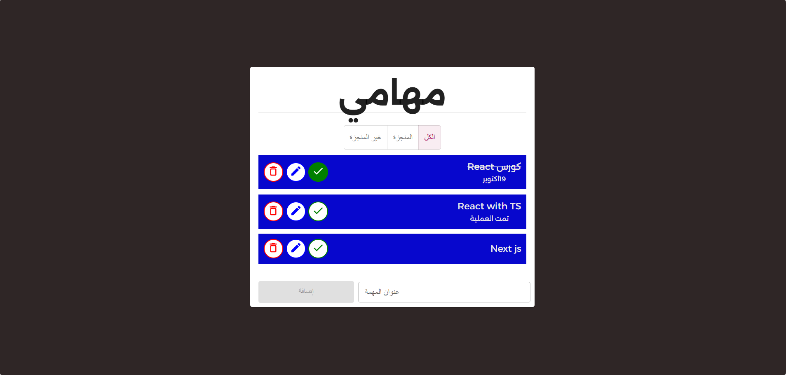

<div align="center">


# مهامي — My Tasks

### A full-featured Arabic Todo List application  
built as a capstone project during a **React.js course**

[](https://reactjs.org/)
[](https://developer.mozilla.org/en-US/docs/Web/JavaScript)
[](https://developer.mozilla.org/en-US/docs/Web/CSS)
[](https://web.dev/progressive-web-apps/)

</div>

---

## 📸 Preview

<div align="center">



</div>

---

## 📖 About The Project

**مهامي** (meaning *"My Tasks"* in Arabic) is a responsive, RTL-supported task management web application developed as part of a **React.js training course**. The project was built to apply and solidify core React concepts learned throughout the course, including component architecture, state management with the Context API, reducers, and modular UI design.

The app allows users to organize their daily tasks efficiently — adding new ones, marking them as complete, editing details, and removing them — all within a clean, Arabic-first interface.

---

## ✨ Features

| Feature | Description |
|---|---|
| ➕ **Add Tasks** | Quickly add new tasks with a title via the input field |
| ✅ **Complete Tasks** | Mark any task as done with a single click |
| ✏️ **Edit Tasks** | Update task details through a modal dialog |
| 🗑️ **Delete Tasks** | Remove tasks with a confirmation modal to prevent accidents |
| 🔍 **Filter Tasks** | Switch between **All**, **Completed**, and **Pending** views |
| 🔔 **Snackbar Feedback** | Instant toast notifications for every user action |
| 📱 **Responsive Design** | Works seamlessly on desktop, tablet, and mobile |
| 🌐 **PWA Support** | Installable as a Progressive Web App |
| 🔠 **Arabic RTL** | Fully right-to-left layout with Arabic UI text |

---

## 🛠️ Built With

This project was built using the following technologies and libraries:

- **[React.js](https://reactjs.org/)** — UI component library
- **[React Context API](https://react.dev/reference/react/useContext)** — Global state management (Todos, Modals, Snackbar)
- **[useReducer](https://react.dev/reference/react/useReducer)** — Predictable state transitions for todos
- **[Material UI (MUI)](https://mui.com/)** — Pre-built UI components (Snackbar, Modal, Buttons)
- **CSS3** — Custom styling and responsive layout
- **[Create React App](https://create-react-app.dev/)** — Project bootstrapping

---

## 🗂️ Project Structure

```
TODO-LIST/
├── public/
│   ├── Fonts/              # Custom Arabic web fonts
│   ├── index.html          # SEO-optimized HTML entry point
│   ├── list.png            # App icon / favicon
│   ├── to-do-app.png       # App screenshot
│   ├── manifest.json       # PWA manifest
│   ├── sitemap.xml         # SEO sitemap
│   └── robots.txt          # Search engine crawl rules
│
└── src/
    ├── Components/
    │   ├── DeleteModal.js  # Confirmation dialog before deletion
    │   ├── MySnackBar.js   # Toast notification component
    │   ├── Todo.js         # Single task card component
    │   ├── TodoList.js     # Main list with filter tabs
    │   └── UpdateModal.js  # Edit task modal dialog
    │
    ├── Contexts/
    │   ├── ModalContext.js    # Controls modal open/close state
    │   ├── SnackBarContext.js # Controls snackbar messages
    │   └── TodosContext.js    # Provides todos state to the tree
    │
    ├── Reducers/
    │   └── TodosReducer.js # Handles ADD, DELETE, UPDATE, TOGGLE actions
    │
    ├── App.css             # Global styles
    └── App.js              # Root component and context providers
```

---

## 🚀 Getting Started

Follow these steps to run the project locally on your machine.

### Prerequisites

Make sure you have the following installed:

- [Node.js](https://nodejs.org/) (v16 or higher)
- [npm](https://www.npmjs.com/) or [yarn](https://yarnpkg.com/)

### Installation

1. **Clone the repository**
   ```bash
   git clone https://github.com/nourhan-ibrahim-atlam/todo-list.git
   cd todo-list
   ```

2. **Install dependencies**
   ```bash
   npm install
   ```

3. **Start the development server**
   ```bash
   npm start
   ```

4. Open your browser and navigate to `http://localhost:3000`

### Build for Production

```bash
npm run build
```

The optimized build will be output to the `/build` folder, ready for deployment.

---

## 🧠 Key React Concepts Applied

This project was specifically designed to practice and demonstrate the following React skills learned during the course:

- **Component Decomposition** — Breaking the UI into small, reusable pieces
- **Props & State** — Passing data down and managing local component state
- **Context API** — Sharing state across the component tree without prop drilling
- **useReducer** — Managing complex state logic in a centralized reducer function
- **Conditional Rendering** — Showing different UI based on task status and filters
- **Event Handling** — Managing user interactions across multiple components
- **Controlled Components** — Form inputs tied to React state

---

## 📈 SEO Optimizations

The project includes production-ready SEO enhancements:

- ✅ Semantic HTML with proper `lang="ar"` and `dir="rtl"` attributes
- ✅ Descriptive `<title>` and `<meta name="description">` tags in Arabic
- ✅ **Open Graph** meta tags for rich social media previews
- ✅ **Twitter Card** meta tags
- ✅ **JSON-LD structured data** for Google rich results
- ✅ `sitemap.xml` for search engine crawling
- ✅ `robots.txt` with `.map` file protection

---

## 🤝 Contributing

Contributions, issues, and feature requests are welcome!  
Feel free to open an [issue](https://github.com/your-username/todo-list/issues) or submit a pull request.

---

## 📄 License

This project is open source and available under the [MIT License](LICENSE).

---

<div align="center">

Made with ❤️ during a React.js course  
**مهامي** — Stay organized, stay productive.

</div>